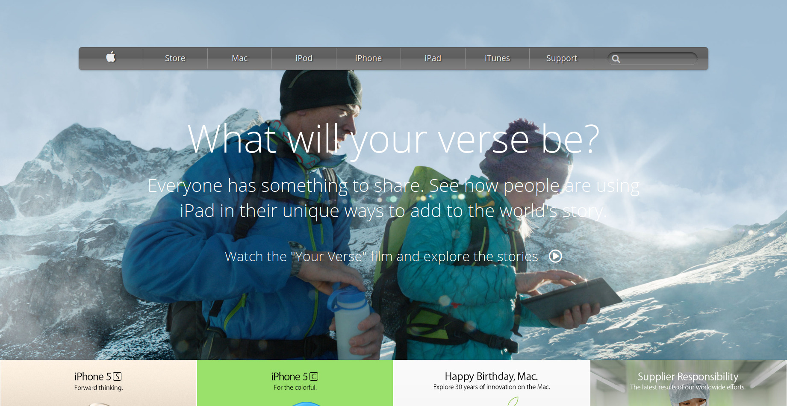

# Apple_Homepage_Clone

> This is my first solo project of the HTML/CSS module at microverse.

This repository is setup for a microverse project to practice the use backgrounds and gradients. I was required to clone the actual page [here](https://web.archive.org/web/20140301004610/http://www.apple.com/). I implemented the nav section as a list which contained all the navigation links. A background gradient was applied to the nav while the entire content-container at the top was given a background image.

Checkout the live version of this project [here](https://raw.githack.com/Cathella/Apple_Homepage_Clone/feature-header/index.html).

## Built with
HTML and CSS

## Author
👤 Nakitto Catherine
- Github: [@Cathella](https://github.com/Cathella)
- Twitter: [@cathella9](https://twitter.com/cathella9)
- Linkedin: [linkedin](https://www.linkedin.com/in/catherine-nakitto-51ba2a40/)

## Getting Started
To use this project in your web page, clone it by "git clone" and if there is some issues please contact us

## Show your support
Star ⭐️⭐️⭐️ this project if you like it, and enjoy!
